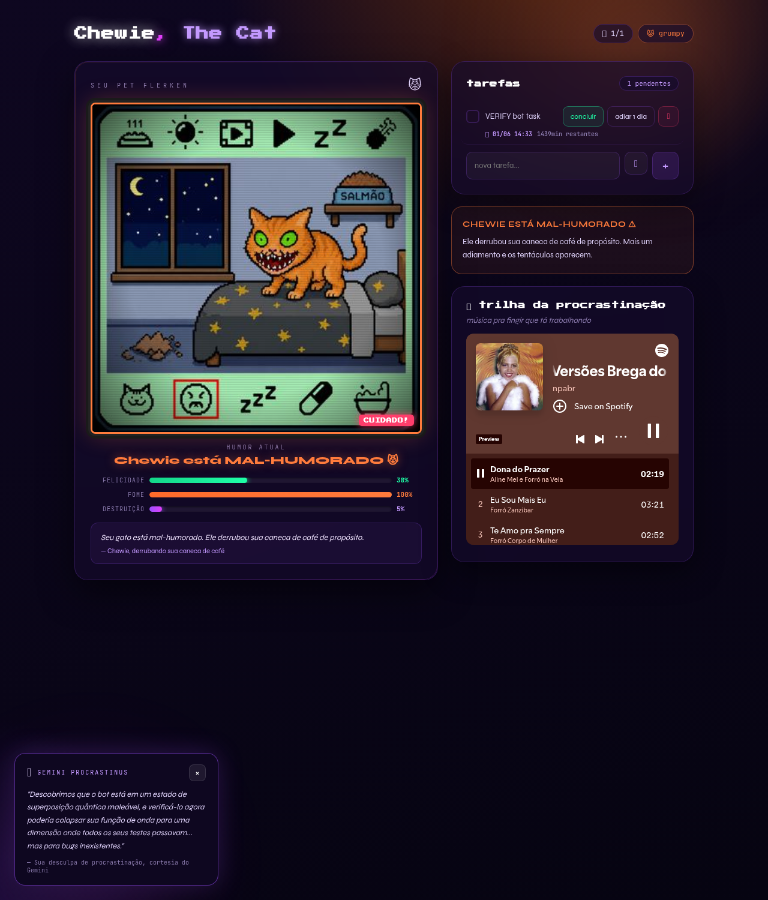
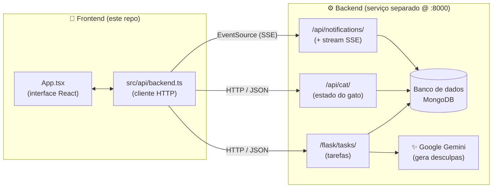
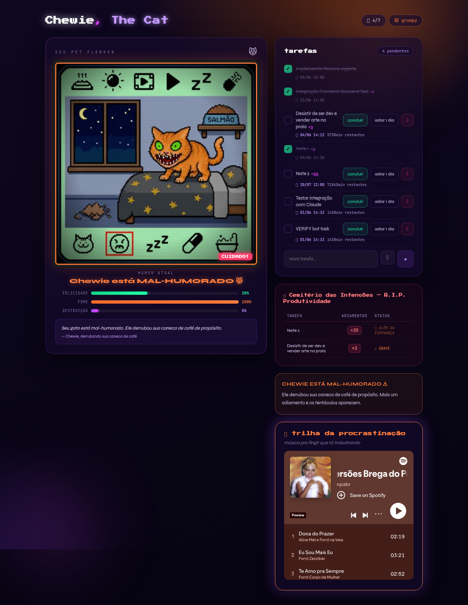
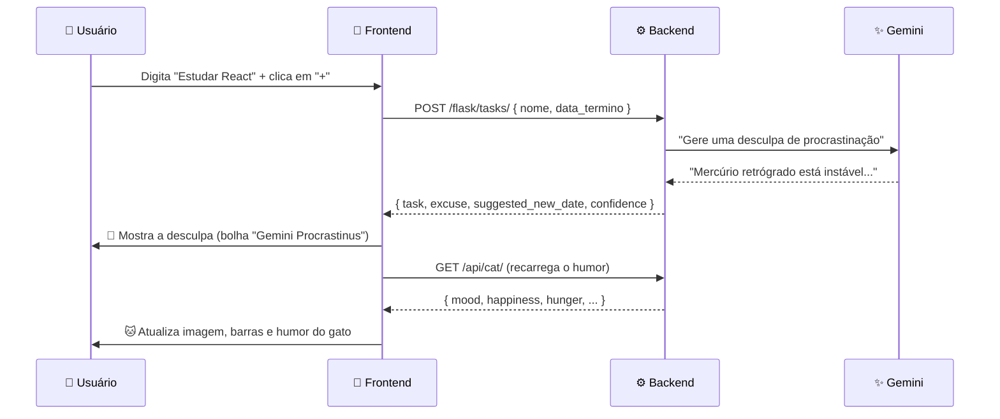

# 🐱 Chewie, The Cat

> Um **pet digital (tamagotchi) para devs e estudantes**: um gato flerken procrastinador cujo humor reage, em tempo real, ao jeito que você cuida das suas tarefas. Conclua tarefas e o Chewie ronrona 😸 — adie ou desista e ele vira um monstro que destrói seu workspace 👹.

<p align="center">
  
</p>

<p align="center">
  <em>Estado do gato à esquerda · tarefas à direita · desculpa gerada por IA no rodapé</em>
</p>

---

## 📖 Índice

- [O que é este projeto](#-o-que-é-este-projeto)
- [Como funciona (em 30 segundos)](#-como-funciona-em-30-segundos)
- [Arquitetura](#-arquitetura)
- [O gato: humores](#-o-gato-humores)
- [As tarefas: ciclo de vida](#-as-tarefas-ciclo-de-vida)
- [Fluxo de uma ação (passo a passo)](#-fluxo-de-uma-ação-passo-a-passo)
- [Referência da API (backend)](#-referência-da-api-backend)
- [Estrutura do frontend](#-estrutura-do-frontend)
- [Como rodar localmente](#-como-rodar-localmente)
- [Variáveis de ambiente](#-variáveis-de-ambiente)
- [Tecnologias](#-tecnologias)
- [FAQ](#-faq)

---

## 🎯 O que é este projeto

O **Chewie** transforma sua lista de tarefas em um bichinho virtual. A ideia é simples e divertida:

- Cada **tarefa** que você cria, conclui, adia ou desiste **muda o humor do gato**.
- O humor é calculado **no servidor (backend)** a partir de métricas como felicidade, fome e nível de destruição.
- Ao criar uma tarefa, uma **IA (Google Gemini)** gera uma “desculpa” criativa para você procrastinar. 😅
- Notificações sarcásticas chegam **em tempo real** (via streaming) enquanto você usa o app.

O projeto é dividido em duas partes:

| Parte | O que é | Stack |
|---|---|---|
| 🎨 **Frontend** | A interface visual (este repositório) | React + Vite + TypeScript |
| ⚙️ **Backend** | A API **“Goose Cat”** que guarda as tarefas, calcula o gato e fala com o Gemini | FastAPI + Flask + MongoDB + Gemini |

> 💡 **Este repositório contém apenas o frontend.** O backend (“Goose Cat 🐱”) roda como um serviço à parte em `http://localhost:8000` — repositório: [`hackcodecon-codequeens-back`](https://github.com/isabelapt/hackcodecon-codequeens-back). O frontend conversa com ele por HTTP.

---

## ⚡ Como funciona (em 30 segundos)

```
   Você cria/conclui/adia/desiste de uma tarefa
                    │
                    ▼
        Frontend chama a API do backend
                    │
                    ▼
   Backend salva no banco e RECALCULA o humor do gato
                    │
                    ▼
   Frontend busca o novo estado do gato (GET /api/cat/)
                    │
                    ▼
        A tela atualiza: imagem, barras e humor 🐱
```

---

## 🏗️ Arquitetura



**Em palavras:**
1. O componente [`App.tsx`](src/App.tsx) desenha a tela e guarda o estado da interface.
2. Toda comunicação com o servidor passa por [`src/api/backend.ts`](src/api/backend.ts) — um cliente HTTP tipado, com uma função por endpoint.
3. O backend é a “fonte da verdade”: ele guarda as tarefas, **recalcula o humor do gato após cada ação** e usa o Gemini para criar desculpas.
4. Notificações chegam por **SSE (Server-Sent Events)** — uma conexão que fica aberta e empurra uma mensagem nova a cada **30 segundos**.

> 🧩 **Curiosidade da arquitetura:** o backend é um **FastAPI** que monta um app **Flask** por dentro (via `a2wsgi`). Por isso as tarefas ficam sob `/flask/...` (rotas Flask) e o gato/notificações sob `/api/...` (rotas FastAPI) — tudo no mesmo servidor, na porta 8000.

---

## 🐱 O gato: humores

O backend devolve o estado atual do gato em `GET /api/cat/`. O frontend usa esse estado direto — **não recalcula nada localmente**.

| Humor | Emoji | Felicidade | O que o gato faz |
|---|:---:|:---:|---|
| `happy` | 😸 | **75–100%** | Radiante! Fazendo biscoitinhos e cantando. |
| `neutral` | 🐱 | **50–75%** | Neutro. Te observando com olhos semicerrados de julgamento. |
| `grumpy` | 😾 | **25–50%** | Mal-humorado. Derrubou sua caneca de café de propósito. |
| `monster` | 👹 | **0–25%** | VIROU UM MONSTRO. Está destruindo seu workspace. |

O card do gato exibe três barras vindas da API:

- **FELICIDADE** → `happiness`
- **FOME** → `hunger`
- **DESTRUIÇÃO** → `destruction_level`

E o texto da fala usa **diretamente** o campo `description` retornado pela API (não há mapeamento manual no frontend).

**Exemplo de resposta de `GET /api/cat/`:**
```json
{
  "mood": "grumpy",
  "happiness": 42.9,
  "hunger": 100.0,
  "destruction_level": 5,
  "description": "Seu gato está mal-humorado. Ele derrubou sua caneca de café de propósito.",
  "last_fed_at": "2026-05-30T19:28:09.072000"
}
```

---

## 📋 As tarefas: ciclo de vida

Uma tarefa tem estes campos no backend:

```jsonc
{
  "id": "6a1b4b59387e067bb723b69f", // ObjectId do MongoDB
  "nome": "Revisar o pull request",
  "data_termino": "2025-12-01T10:00:00", // prazo (ISO 8601)
  "concluida": false,
  "vezes_adiada": 0,
  "desistiu": false,
  "desculpa": "Mercúrio retrógrado está...", // gerada pelo Gemini ao criar
  "criada_em": "2025-11-28T09:00:00"
}
```

O usuário interage por **3 botões** em cada tarefa:

| Botão | O que faz na tela | O que o frontend envia |
|---|---|---|
| ✅ **Concluir** | A tarefa fica **marcada e riscada** (continua visível) | `PATCH { concluida: true }` |
| ⏸ **Adiar 1 dia** | Soma 1 dia ao prazo e mostra o contador `×N` de adiamentos | `PATCH { data_termino: <+1 dia>, vezes_adiada: <+1> }` |
| 🏳️ **Desistir** | A tarefa **some** da lista | `PATCH { desistiu: true }` |

> 🧮 **O cálculo do "+1 dia" é feito no frontend.** Ele lê a `data_termino` atual, soma 24h preservando o formato ISO e envia de volta junto com `vezes_adiada` incrementado.

Tarefas com `vezes_adiada > 0` ainda aparecem em uma tabela bem-humorada — o **“Hall da Vergonha”** 🏆 — classificadas por gravidade (`😐 ruim → ⚠️ grave → 🔥 crítico → 🐙 além da esperança`).

<p align="center">
  
</p>

---

## 🔄 Fluxo de uma ação (passo a passo)

Exemplo: **criar uma nova tarefa**.



O mesmo padrão vale para concluir/adiar/desistir: **age → PATCH → recarrega o gato → re-renderiza**.

---

## 🌐 Referência da API (backend)

**Base URL:** `http://localhost:8000` · **CORS:** liberado para qualquer origem (`*`).

### Tarefas — `/flask/tasks/`

| Método | Rota | Descrição |
|---|---|---|
| `GET` | `/flask/tasks/` | Lista todas as tarefas |
| `GET` | `/flask/tasks/{id}` | Busca uma tarefa |
| `POST` | `/flask/tasks/` | Cria uma tarefa (o backend consulta o Gemini) |
| `PATCH` | `/flask/tasks/{id}` | Atualiza (concluir, adiar ou desistir) |

**Criar tarefa** — `POST /flask/tasks/`
```jsonc
// Requisição
{ "nome": "Estudar React", "data_termino": "2025-12-01T10:00:00" }

// Resposta
{
  "task": { "id": "...", "nome": "...", "concluida": false, "vezes_adiada": 0, "desistiu": false, "desculpa": "..." },
  "excuse": "Mercúrio retrógrado está causando instabilidade nos commits.",
  "suggested_postpone_hours": 48,
  "suggested_new_date": "2025-12-03T10:00:00",
  "confidence": 94
}
```
> O campo **`excuse`** é exibido para o usuário como notificação assim que a tarefa é criada.

**Atualizar tarefa** — `PATCH /flask/tasks/{id}`
```jsonc
// Adiar 1 dia (data calculada no frontend + incremento)
{ "data_termino": "2025-12-02T10:00:00", "vezes_adiada": 2 }

// Concluir
{ "concluida": true }

// Desistir
{ "desistiu": true }
```

### Gato — `/api/cat/`

| Método | Rota | Descrição |
|---|---|---|
| `GET` | `/api/cat/` | Estado atual do gato (recalculado após cada ação nas tarefas) |

### Notificações — `/api/notifications/`

| Método | Rota | Descrição |
|---|---|---|
| `GET` | `/api/notifications/` | Lista as notificações |
| `POST` | `/api/notifications/mark-read` | Marca todas como lidas |
| `GET` | `/api/notifications/stream` | **Stream SSE** — envia uma notificação nova a cada ~30s |

**Consumindo o stream no frontend:**
```js
const source = new EventSource("http://localhost:8000/api/notifications/stream");
source.onmessage = (event) => {
  const n = JSON.parse(event.data);
  // n.message  → texto da notificação
  // n.category → ex: "cat_destruction" (destacada em vermelho)
};
```

---

## 🗂️ Estrutura do frontend

```
tamagotchi/
├── index.html              # ponto de entrada HTML
├── docs/                   # imagens usadas neste README
├── public/                 # ícones e favicon
└── src/
    ├── main.tsx            # bootstrap do React
    ├── App.tsx             # ⭐ toda a UI + estado + integração com o backend
    ├── index.css           # reset mínimo de CSS
    ├── api/
    │   └── backend.ts      # ⭐ cliente HTTP do backend (tasks, cat, SSE)
    ├── components/
    │   └── SpotifyCard.tsx  # player de música embutido (toca ao criar tarefa)
    └── assets/
        ├── images.ts        # imagens base64 do Chewie (6 estados)
        └── Chewie_-_*.webp  # imagens originais (pixel art)
```

> 🧹 **Nota:** alguns arquivos em `src/hooks/`, `src/data/`, `src/types/` e parte de `src/components/` são de uma versão modular anterior e **não são usados** pela aplicação atual (que vive em `App.tsx`). Podem ser removidos numa limpeza futura.

**Os dois arquivos que importam:**
- [`src/App.tsx`](src/App.tsx) — desenha tudo (gato, tarefas, notificações) e orquestra as chamadas.
- [`src/api/backend.ts`](src/api/backend.ts) — uma função por endpoint, com tipos TypeScript do backend (`BackendTask`, `CatState`, etc.) e helpers de data.

---

## 🚀 Como rodar localmente

### Pré-requisitos
- **Node.js 18+** (recomendado 20+) e **npm**
- O **backend rodando** em `http://localhost:8000` (serviço separado)

### 1. Suba o backend (“Goose Cat”)
O backend é um projeto separado ([`hackcodecon-codequeens-back`](https://github.com/isabelapt/hackcodecon-codequeens-back)). Configure o `.env` dele com sua chave do Gemini e a conexão do MongoDB:

```bash
# dentro da pasta do backend
cp .env.example .env       # preencha GEMINI_API_KEY, MONGODB_URL e MONGODB_DB
```

E suba de uma das formas:

```bash
# Opção A — Docker (mais prático)
docker compose up --build

# Opção B — local (Python 3.11+)
pip install -r requirements.txt
uvicorn main:app --host 0.0.0.0 --port 8000 --reload
```

Confira se está no ar:
```bash
curl http://localhost:8000/api/cat/
# deve responder um JSON com mood, happiness, hunger...
```
> 📚 Documentação interativa da API (Swagger): `http://localhost:8000/docs`

### 2. Rode o frontend
```bash
# instalar dependências
npm install

# subir o servidor de desenvolvimento
npm run dev
```
Abra o endereço que o Vite mostrar (ex.: `http://localhost:5173`). Pronto! 🎉

### Outros comandos
```bash
npm run build     # gera a versão de produção em dist/
npm run preview   # serve o build de produção localmente
npm run lint      # roda o ESLint
```

> ⚠️ **Sem o backend no ar**, o app abre, mas mostra um aviso no topo (“Backend não encontrado em localhost:8000”). Suba o backend e recarregue a página.

---

## 🔧 Variáveis de ambiente

Crie um arquivo `.env` na raiz (opcional). Veja `.env.example`.

| Variável | Padrão | Para que serve |
|---|---|---|
| `VITE_API_BASE_URL` | `http://localhost:8000` | URL base do backend. Em produção, aponte para o seu servidor. |

Exemplo:
```bash
# .env
VITE_API_BASE_URL=http://localhost:8000
```

---

## 🛠️ Tecnologias

**Frontend**
- ⚛️ **React 19** + **TypeScript**
- ⚡ **Vite** (build e dev server)
- 🎨 **CSS-in-JS** (estilos inline + animações via `<style>` global)
- 🔤 Fontes: *Press Start 2P*, *JetBrains Mono*, *Syne*
- 📡 **EventSource** (SSE) para notificações em tempo real

**Backend** — “Goose Cat 🐱” (serviço separado, Python 3.11+)
- 🚀 **FastAPI** (framework principal — gato e notificações sob `/api/`)
- 🌶️ **Flask** montado por dentro via **`a2wsgi`** (tarefas sob `/flask/`)
- 🍃 **MongoDB** via **Motor** (async) + **PyMongo** (sync)
- ✨ **Google Gemini 2.5 Flash** (gera as desculpas de procrastinação)
- ⏰ **APScheduler** (gera notificações inúteis em segundo plano)
- 🦄 **Uvicorn** (servidor ASGI)

---

## ❓ FAQ

**O humor do gato é calculado no frontend?**
Não. O backend recalcula o humor após **cada** operação nas tarefas (POST/PATCH). O frontend só faz `GET /api/cat/` para exibir o estado atual.

**Por que a tela mostra “Backend não encontrado”?**
O serviço em `localhost:8000` não está respondendo. Suba o backend e recarregue.

**Preciso de uma chave do Gemini no frontend?**
Não. A IA é chamada **pelo backend** — a chave nunca vai para o navegador. O frontend só recebe o campo `excuse` pronto.

**As notificações somem sozinhas?**
Sim. Elas aparecem como “Breaking News” no canto e fecham automaticamente; as da categoria `cat_destruction` ficam destacadas (vermelho + tremor na tela).

**Concluir uma tarefa apaga ela?**
Não — a tarefa concluída fica **visível, marcada e riscada**. Só “Desistir” faz a tarefa desaparecer da lista.

---

<p align="center">
  Feito com 💜 (e muita procrastinação supervisionada pelo Chewie) 🐱
</p>
